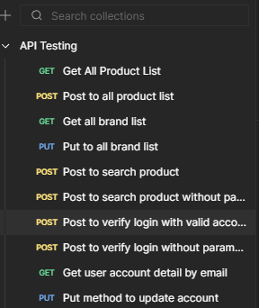
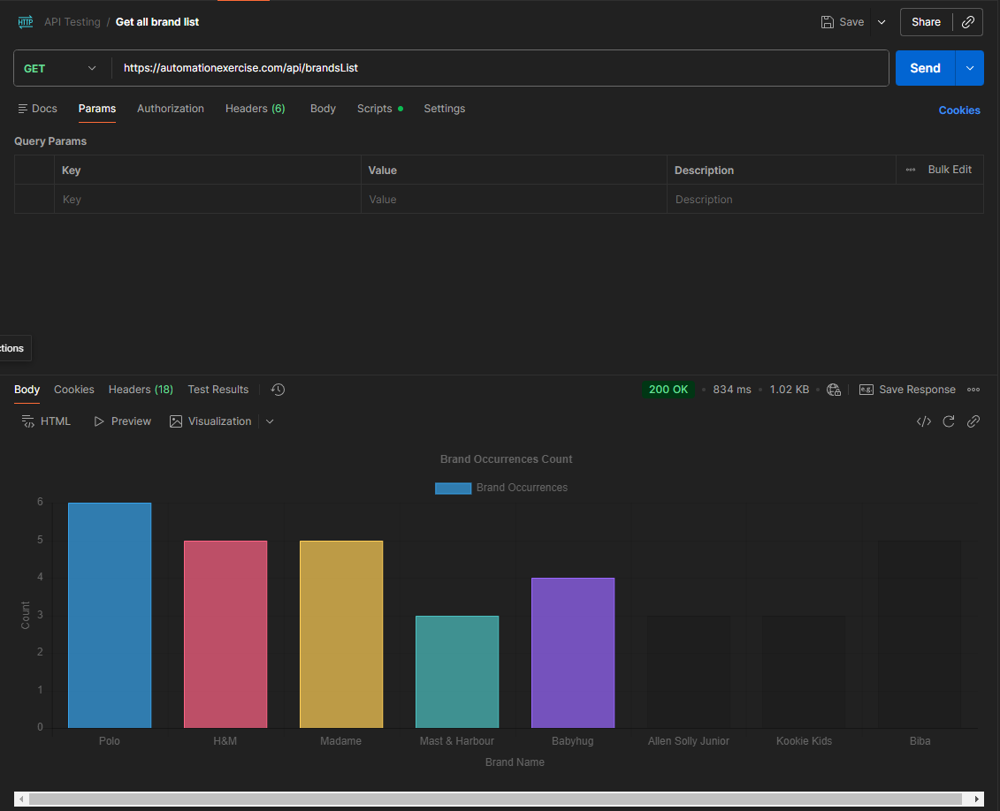
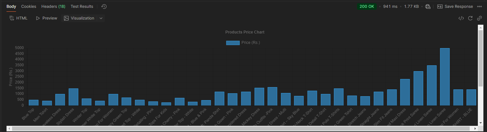
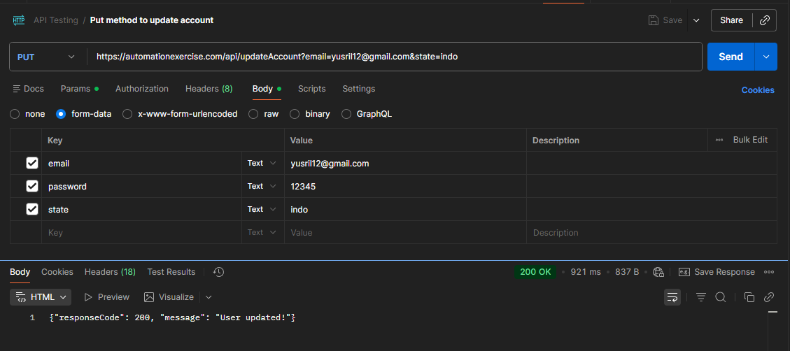
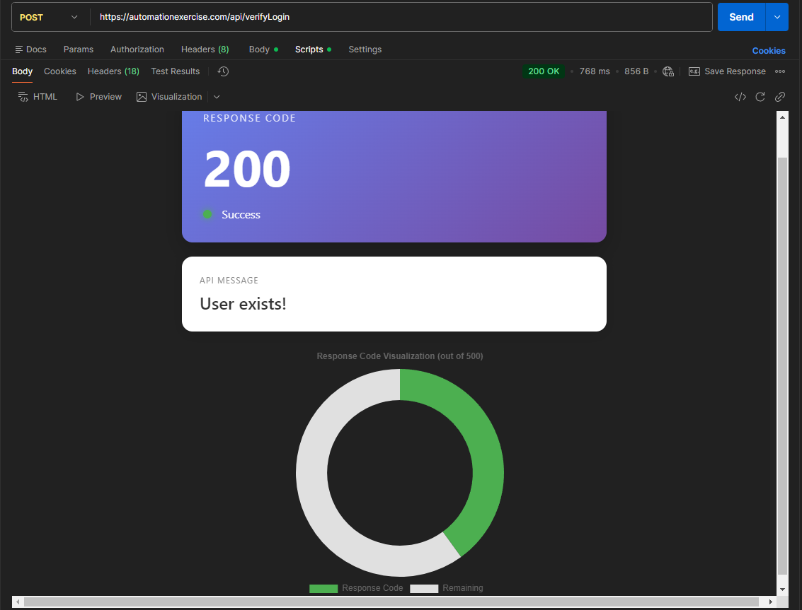
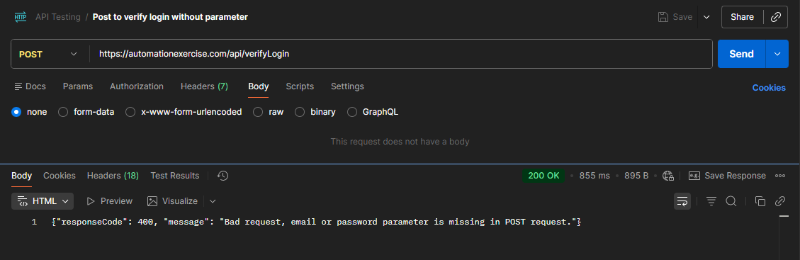

# API Testing : Automation Exercise 🚀

This project demonstrates professional API testing procedures using **Postman**. It covers functional testing, data validation, and advanced data visualization for an e-commerce platform's REST API.

## 📌 Project Overview
The objective of this project is to validate the reliability and integrity of various endpoints from the [Automation Exercise API](https://automationexercise.com/api_list). The testing suite ensures that products, brands, and user accounts can be managed correctly through different HTTP methods.

## 🛠️ Tech Stack & Tools
* **Testing Tool:** Postman (Collection v2.1.0)
* **API Architecture:** REST
* **Data Format:** JSON
* **Visualization:** Postman Visualizer (HTML/CSS/JS)
* **Environment:** Production - `https://automationexercise.com/api`

## 📋 Test Scenarios
The collection contains **10 test cases** including positive and negative testing:

| No | Scenario | Method | Endpoint | Description |
|:---|:---|:---:|:---|:---|
| 1 | Get All Products | `GET` | `/productsList` | Retrieve full list of products |
| 2 | Add Product | `POST` | `/productsList` | Negative test: adding products |
| 3 | Get All Brands | `GET` | `/brandsList` | Retrieve all brand data |
| 4 | Update Brands | `PUT` | `/brandsList` | Method validation for brand updates |
| 5 | Search Product | `POST` | `/searchProduct` | Search with 'search_product' param |
| 6 | Search (No Param) | `POST` | `/searchProduct` | Negative test: empty parameters |
| 7 | Valid Login | `POST` | `/verifyLogin` | Authentication with valid account |
| 8 | Invalid Login | `POST` | `/verifyLogin` | Negative test: missing credentials |
| 9 | Get User Detail | `GET` | `/getUserDetailByEmail` | Fetch user profile by email |
| 10 | Update Account | `PUT` | `/updateAccount` | Update user profile information |

## 📊 Test Results & Visualizations
Detailed evidence of the testing process and data analysis.

<details>
  <summary><b>📷 Click to view Test Screenshots</b></summary>
  <br>

  #### 1. Professional Collection Workspace
  Consistent use of HTTP methods (GET, POST, PUT) organized in a clean workspace.
  

  #### 2. Advanced Data Visualization (Data Analyst Skill)
  Transforming raw JSON data into interactive Brand Occurrences and Price charts using Postman Visualizer.
  
  

  #### 3. Functional Validation (User Management)
  Successful validation of account updates using `form-data` with status 200 OK.
  

  #### 4. API Response Dashboard
  Professional visualization of response codes and success status messages.
  

  ### 5. Negative Testing (Error Handling)
  Validation of the system's behavior when mandatory parameters are missing. The API correctly returns a 400 Bad Request status with a descriptive error message.
  

</details>

## ⚙️ How to Run
1.  **Clone the Repository:**
    ```bash
    git clone [https://github.com/zRILLL28/api-testing-portfolio.git](https://github.com/zRILLL28/api-testing-portfolio.git)
    ```
2.  **Import to Postman:**
    * Open Postman.
    * Click **Import** and select the file `API Testing.postman_collection.json`.
3.  **Execute:**
    * Select any request and click **Send**.
    * Check the **Body > Visualization** tab for the graphical report.
